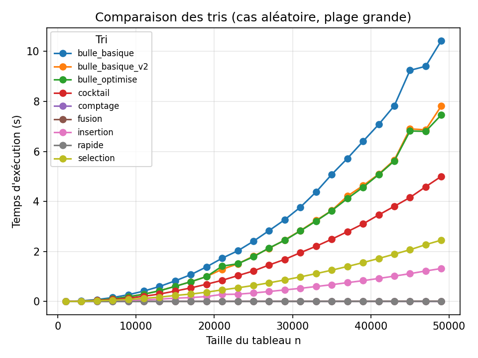

# Comparaison d'Algorithmes de Tri

> Projet C + Python — Algorithmique | L3 MIAGE / CMI, Université Paris Nanterre

Étude expérimentale de plusieurs algorithmes de tri : implémentation en C, benchmarks sur des tableaux de taille variable, et visualisation des performances.

## Algorithmes implémentés

| Algorithme | Complexité (pire cas) | Notes |
|-----------|----------------------|-------|
| Tri à bulle basique | O(n²) | Version naïve |
| Tri à bulle v2 | O(n²) | Réduction du domaine |
| Tri à bulle optimisé | O(n) meilleur cas | Arrêt anticipé |
| Tri cocktail | O(n²) | Bidirectionnel |
| Tri par insertion | O(n²) | Efficace sur petit n |
| Tri par sélection | O(n²) | Peu d'échanges |
| Tri fusion | O(n log n) | Diviser pour régner |
| Tri rapide | O(n log n) moy. | Référence pratique |
| Tri par comptage | O(n + k) | Linéaire (entiers) |

## Structure

```
projet-algo-tri/
├── src/
│   ├── tri.c           # Implémentation de tous les algorithmes
│   └── benchmark.c     # Mesure des temps d'exécution
├── analysis/
│   └── plots.py        # Génération des graphiques (matplotlib)
├── data/
│   └── resultats.csv   # Résultats bruts des benchmarks
├── figures/            # Graphiques de performance générés
├── report/
│   ├── main.tex        # Rapport LaTeX
│   └── latex.pdf       # Rapport compilé
└── README.md
```

## Compilation & exécution

```bash
# Compiler le benchmark
gcc -O2 -o benchmark src/benchmark.c -lm

# Lancer les mesures
./benchmark

# Générer les graphiques
python3 analysis/plots.py
```

## Méthodologie

- **Tailles testées :** 1 000 à 20 000 éléments (pas de 1 000)
- **Types de données :** aléatoire, trié croissant, trié décroissant
- **Mesure :** `clock()` en C, moyenne sur plusieurs runs
- **Visualisation :** courbes de temps d'exécution en fonction de n

## Résultats

Voir [`report/latex.pdf`](report/latex.pdf) pour l'analyse complète.



## Stack technique

| Outil | Usage |
|-------|-------|
| C (gcc) | Implémentation & benchmarking |
| Python 3 | Visualisation |
| matplotlib | Graphiques de performance |
| LaTeX | Rapport |

## Auteur

**Marwane El Bachir** — [LinkedIn](https://www.linkedin.com/in/marwane-el-bachir-400b8a389/)  
L3 CMI Data Science — Université Paris Nanterre
